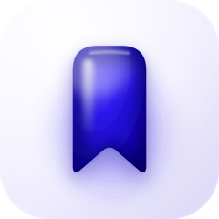
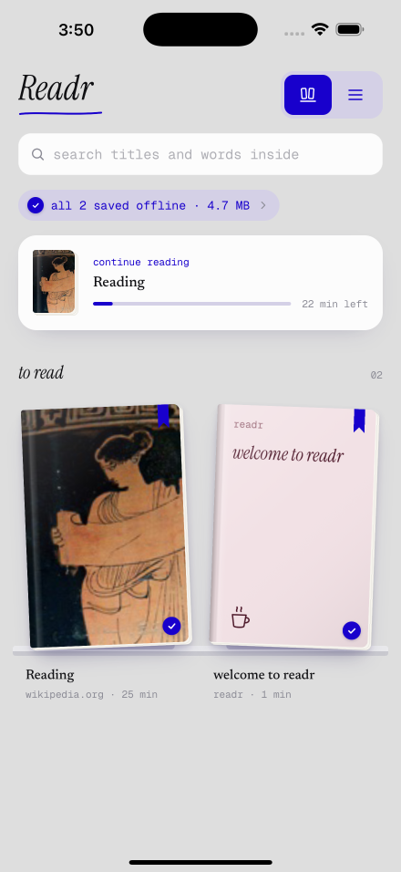
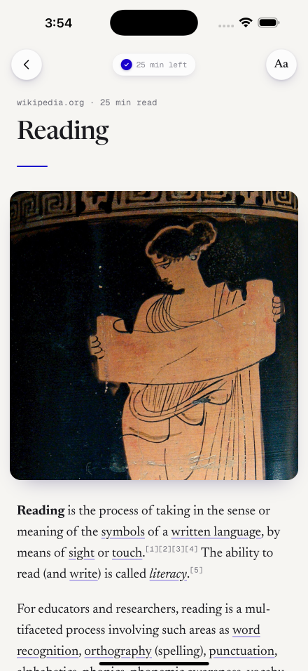
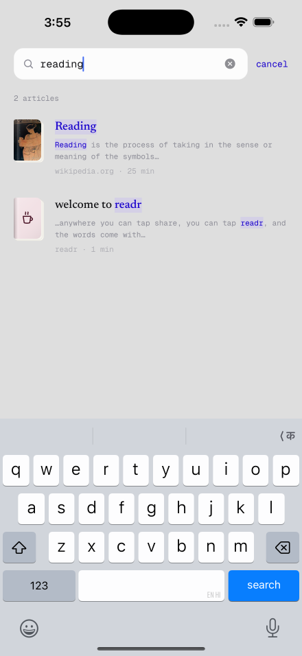
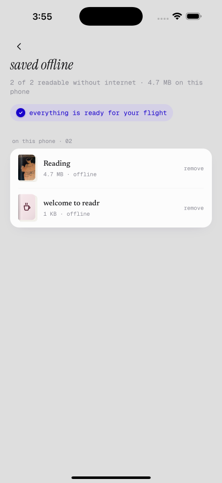
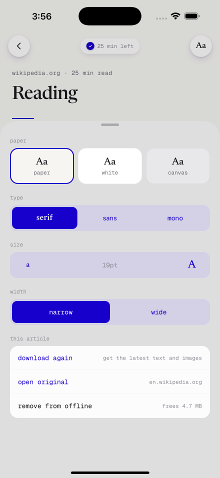

<div align="center">



# Readr

Save any page from the share sheet. Read it anywhere — even offline, even at 38,000 ft.

</div>

<br />

Readr is an iOS app built with Expo. Share a page to it from Safari (or almost any app), and
Readr extracts the article — text and images — and saves it to the phone. No connection needed
to read it later.

<table>
<tr>
<td></td>
<td></td>
<td></td>
<td></td>
</tr>
</table>

## Features

- **Share-sheet capture** — a native Safari/share extension runs [Readability](https://github.com/mozilla/readability)
  right on the page, pulls the article text and images, and hands them to the app. Works from
  Safari, or from any app that can share a URL.
- **Actually offline** — text and every image are downloaded to the phone, not just cached. A
  retry queue quietly finishes downloads that started with a weak connection, and picks back up
  the moment the phone is back online.
- **Saved offline, on your terms** — see exactly what's stored and how much space it takes, remove
  an article's offline copy without losing it from your library, or bring it back with one tap.
- **Global search** — search titles, sites and the full text of everything you've saved, powered by
  SQLite FTS5. Works with no connection, since the text is already on the phone. Opening a result
  jumps straight to the matching sentence.
- **Continue reading** — the library remembers where you left off and surfaces it up front.
- **A calm reading view** — a WebView-based reader with adjustable paper tone, type, size and
  column width; Newsreader for body text, Instrument Serif for the odd italic accent, Geist Mono
  for UI chrome.
- **Delight, not decoration** — hand-tuned haptics, spring-based motion (respecting Reduce Motion),
  and an in-app tutorial with a picture-in-picture walkthrough of how to share a page in.

<table>
<tr>
<td></td>
</tr>
</table>

## How it works

Readr is one Expo app plus a native iOS share extension, sharing logic between them:

```
src/
  core/        pure logic shared with the share extension (article IDs, doodle picks)
  extract/     Readability-based extraction: text, images, hero image, tracking-pixel filtering
  data/        SQLite (expo-sqlite, WAL, FTS5) — articles, settings, search index
  sync/        ingest, retry queue, offline management, connectivity
  features/    library, reader, search, offline, onboarding, tutorial
  design/      tokens, motion, typography, doodles — the design system
  app/         Expo Router routes

targets/share/ the native SwiftUI share extension (via @bacons/apple-targets)
```

The share extension and the app both need the extraction logic, but one runs in JavaScriptCore
inside an app extension and the other in React Native. `scripts/build-bundles.ts` compiles
`src/core` and `src/extract` with esbuild into plain JS bundles the Swift side loads directly, so
there's exactly one implementation of "how to turn a web page into an article."

Saved articles live in an App Group container as `meta.json` + `content.html` + downloaded
images, readable by both the extension and the app. The reader itself is a local
`file://` HTML page rendered in a `react-native-webview`, built once per template version and
never rewritten — reading settings apply live through CSS custom properties.

## Stack

[Expo SDK 57](https://expo.dev) (React Native 0.86, React 19) · [Expo Router](https://docs.expo.dev/router/introduction/)
· expo-sqlite (WAL + FTS5) · [Reanimated 4](https://docs.swmansion.com/react-native-reanimated/) +
Gesture Handler · expo-video (picture-in-picture) · [@bacons/apple-targets](https://github.com/EvanBacon/expo-apple-targets)
for the native share extension · [@mozilla/readability](https://github.com/mozilla/readability) ·
zustand · FlashList

## Getting started

Readr uses native modules (a share extension, an App Group), so it needs a
[development build](https://docs.expo.dev/develop/development-builds/introduction/) — it won't
run in Expo Go.

```bash
npm install                 # also builds the shared JS bundles and generates Swift assets
npx expo prebuild -p ios    # generates ios/ (never edit it by hand — see AGENTS.md)
npx expo run:ios            # builds and launches the dev client
```

Day to day, once the dev client is installed:

```bash
npx expo start --dev-client
```

Other useful commands:

```bash
npm test              # jest — core/extract logic + app unit tests
npx tsc --noEmit       # typecheck
npx expo lint          # lint
npm run bundles        # rebuild the shared JS bundles for the share extension
```

You'll need your own Apple team ID (`APPLE_TEAM_ID` env var) and an App Group entitlement to run
the share extension end to end; see `app.config.ts`.

## Project docs

Design decisions and the design system live in [`docs/design/`](docs/design); planning and
brainstorm history in [`docs/brainstorms/`](docs/brainstorms) and [`docs/plans/`](docs/plans).
Repo and Expo conventions are in [`AGENTS.md`](AGENTS.md).
