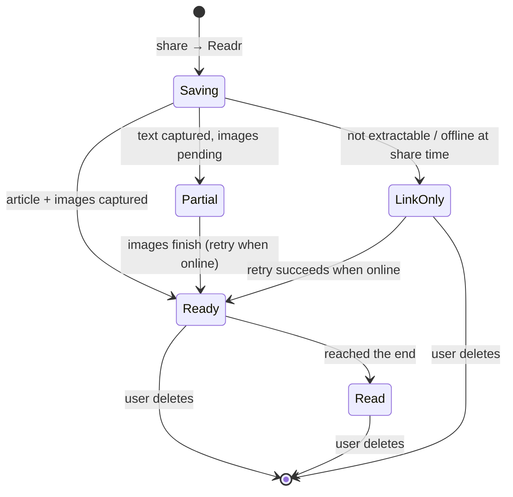

# Readr — offline read-later for iOS

## Summary

Readr is an iOS app, built with Expo, for saving articles to read offline:
- **Saving:** from Safari or any other app, you share a page and tap Readr. The full article, text and images, is saved on the phone.
- **Reading:** it opens with no internet, on a plane or anywhere else.
- **Look:** the app uses One Year's visual language and sets articles in an editorial serif like Every's.
- **Feel:** haptics and doodle animations throughout.

---

## Problem Frame

Flights and other dead zones are when people finally have time to read, and they are also when a saved link fails. Most "read later" saves are only a link. The article isn't there when the signal is gone, or it shows up without images.

The save has to capture the content at the moment of sharing, and the app has to say honestly whether each item will work offline.

---

## Key Decisions

- **Capture happens when you share, not when you next open the app.** If you save at the gate and never open Readr before takeoff, the article still has to be readable offline.
- **Pages that aren't clean articles are saved as link-only, with a warning.** Readr does not keep a lower-quality snapshot. It stores the link, marks it "needs internet", and retries later.
- **The library is a list with doodles, not a copy of One Year's grid.** Rows stay easy to scan. Each article gets its own doodle, and a row of dots at the top shows this month's saves.
- **Light-only.** There is no dark mode. The reader offers three light paper tones instead.
- **The first save happens inside the app, then the tutorial moves to Safari.** Onboarding opens the real share sheet on a sample article inside Readr. After that, an optional tutorial video floats over Safari as picture-in-picture.
- **Free, with no account.** There is no paywall, trial or sign-in in v1.

---

## Key Flows

- F1. **Save from Safari**
  - **Trigger:** The user taps Share on any page in Safari.
  - **Steps:**
    1. The user taps Readr.
    2. A save card slides up and the article's doodle draws itself.
    3. The page is captured exactly as the user sees it, including content behind a login or paywall they have already unlocked.
    4. The card shows "saved for later" with a success haptic, then dismisses itself.
  - **Outcome:** The user is back in Safari within about 2 seconds, and the article is readable offline.
  - **Covers:** R1, R2, R3, R6.

- F2. **Save from another app** (Chrome, X, Messages, Slack…)
  - **Trigger:** The user shares a link from any other app.
  - **Steps:** Readr fetches the page and extracts the article. If that fails, it saves link-only and the card says "saved link — needs internet".
  - **Covers:** R1, R4, R5.

- F3. **First run**
  - **Steps:**
    1. One Year–style onboarding shows a phone mock of the share sheet.
    2. The user taps "save my first article", which opens the real share sheet on a sample article inside Readr.
    3. The user taps Readr and sees the article land in the library, with a celebration.
    4. Optionally, "try it in safari" opens Safari with the tutorial video still playing in picture-in-picture over it.
    5. When the first real save from Safari arrives, the tutorial closes and a "you did it" moment plays.
    6. A short founder-letter-style note closes onboarding.
  - **Covers:** R13–R16.

- F4. **Read offline**
  - **Steps:**
    1. The user opens the library, where an "offline" chip shows if there is no signal.
    2. Tapping an article opens it with a zoom transition.
    3. The user reads with the chrome hiding as they scroll.
    4. Reaching the end shows "fin." with a soft haptic.
    5. The article is marked read. Its dot becomes its doodle and it moves to the "read" section.
  - **Covers:** R7–R11.

- F5. **Pre-flight check**
  - **Steps:**
    1. The user opens Readr before boarding while still online.
    2. The header shows "**02** not ready offline" and Readr is already retrying those items.
    3. When everything is ready, the header says "all set for your flight".
  - **Covers:** R5, R12.

---

## Requirements

**Saving**
- R1. Readr appears as an option in the iOS share sheet for web pages and links shared from any app.
- R2. Sharing saves immediately, with no confirm step. The save card shows one of three outcomes: "saved for later", "already saved", or "saved link — needs internet".
- R3. From Safari, the saved article reflects the page as the user sees it, including content they have already unlocked.
- R4. Each save stores a clean reading version: title, author, site, lead image, body, all inline images, and reading time. If a clean version can't be extracted, the save is stored as link-only.
- R5. Link-only saves and articles with missing images retry automatically whenever the app is open with internet.
- R6. The save card offers undo, and it never takes longer than about 2 seconds before it can be dismissed.

**Library**
- R7. The library lists unread articles newest first. Each row has a doodle stamp, a serif title, and mono meta (site · minutes · saved-when). Read articles sit in a collapsed "read" section below.
- R8. Each article's doodle is fixed. The same link always gets the same doodle.
- R9. The header shows a row of dots, one per article saved this month. A dot becomes its doodle once that article is read.
- R10. Swiping a row deletes it, with a haptic when the swipe crosses the threshold. Deleting is the only way articles leave the app.

**Reading**
- R11. The reader works fully offline. It includes the serif typesetting, a progress hairline, chrome that hides on scroll, and a "fin." end state that marks the article read. It remembers where you stopped.
- R12. Reader settings offer three light paper tones, a serif/sans/mono choice, text size, and column width. Settings persist across articles.

**Onboarding and tutorial**
- R13. Onboarding teaches the share-sheet save using One Year's layout: phone mock, one ink keyword, an ink button, and a faded "skip".
- R14. The first save is practised inside the app, using the real share sheet on a sample article.
- R15. An optional tutorial video plays in an in-app mini player that can be dragged to any corner. It keeps playing as system picture-in-picture when the user leaves for Safari.
- R16. Readr detects the user's first real save and celebrates it once.

**Look and feel**
- R17. The UI follows `docs/design/design-system.md`:
  - **Colours:** the grey canvas with one ink, with numbers in ink in copy.
  - **Type:** lowercase Geist Mono for the UI, and Newsreader with Instrument Serif Italic for reading.
  - **Illustration:** doodles as the only illustration system.
- R18. Every interaction listed in the design system's motion table has its animation and haptic. When Reduce Motion is on, animations fall back to fades.
- R19. When the device is offline, the library says so warmly ("no signal. everything here still works.") rather than showing an error.

---

## Acceptance Examples

- AE1. **Covers R2, R8.** Given an article is already saved, when the user shares the same URL again (including tracking-parameter variants), the card shows "already saved" with a warning haptic, and no duplicate appears.
- AE2. **Covers R4, R2.** Given the user shares an X/Twitter post or a web app, when extraction fails, the item is saved link-only and the card says "saved link — needs internet". It appears in the library with a "needs internet" marker.
- AE3. **Covers R3.** Given the user is logged into a paywalled site in Safari and can see the full article, when they share it, the full body is saved, not the paywall stub.
- AE4. **Covers R5, R12 / F5.** Given 2 items are link-only or missing images, when the app opens online, the header reads "**02** not ready offline" and retries run. When both succeed, it reads "all set for your flight".
- AE5. **Covers R1, F1.** Given the user saves in Safari and never opens Readr, when they later open the app in airplane mode, the article opens with its text and images.
- AE6. **Covers R11.** Given the user scrolls to the end of an article, "fin." appears with a soft haptic. The row moves to "read" and its header dot becomes its doodle.
- AE7. **Covers R15, R16.** Given the tutorial is playing and the user taps "try it in safari", the video continues in picture-in-picture over Safari. When their first Safari save lands, the tutorial ends and the celebration plays once.

---

## Success Criteria

- A new user completes a practice save within 60 seconds of opening the app, without reading instructions twice.
- From tapping Readr to being back in the source app takes 2 seconds or less for a typical article.
- On a real flight, every item marked ready opens with text and images and zero network errors.
- The app is recognisably "One Year–like" at a glance, and articles read like Every.

---

## Scope Boundaries

**Deferred for later**
- Bookmarks and highlights
- On-device full-text search and Spotlight indexing
- Tags and folders
- Saving PDFs
- Text-to-speech

**Outside this product's identity (v1)**
- Accounts, cloud sync, and web or desktop clients. Readr is on-device only.
- Dark mode
- Android
- Paywall, trial or subscription
- Social or recommendation feeds

---

## Dependencies / Assumptions

- A paid Apple Developer account is required, because sharing storage between the extension and the app needs an App Group.
- The app runs as a development build, not Expo Go.
- The fonts are free (Newsreader, Instrument Serif, Geist Mono). Every's Signifier would need a Klim app licence later.
- The tutorial video will be a 20–30 second captioned screen recording, produced separately.
- Share-sheet placement is controlled by iOS. The user may have to scroll or pin Readr, and onboarding covers this.

---

## Outstanding Questions

**Deferred to Planning**
- Native SwiftUI share extension or React Native inside the extension. This decides extension memory use and how fast it opens.
- How the reader renders: a web view with our own stylesheet, or native text. This affects typography fidelity and future highlighting.
- Where extraction and image downloading run, so that the "within about 2 seconds" budget in R6 holds.
- The canonical-URL rules for detecting duplicates (AE1).
- How the in-app sample article is served for the practice save (R14): bundled or hosted.

---

## Sources

- `docs/design/design-system.md`: tokens, components, motion, voice, Mobbin references.
- **Mobbin, One Year:**
  - [home](https://mobbin.com/screens/8ce281b6-ebee-4eb0-a5e4-78c0a10d9644)
  - [onboarding flow](https://mobbin.com/flows/e425e896-eae7-48d4-83b6-035f43ac0002)
  - [compose](https://mobbin.com/screens/72c214e7-a08f-445d-88d3-e14b6ce72d4a)
  - [widget](https://mobbin.com/screens/d41449e1-f8f9-4d11-8a22-d094adc74923)
- **Mobbin, share-sheet setup:**
  - [Matter save flow](https://mobbin.com/flows/1f7f30d1-a7a8-4d71-9974-36293a69e54c)
  - [Corner set up sharing](https://mobbin.com/flows/39ef667a-d234-42a1-88d7-1f0ac8a602a7)
  - [Cosmos extension setup](https://mobbin.com/flows/a8ecbff2-5d9c-45a9-9c1d-d33041bfb16b)
- **Mobbin, reader settings:**
  - [Matter](https://mobbin.com/screens/e4fcf13d-19d3-419c-9eb0-37f8cf219cf3)
  - [Fable](https://mobbin.com/screens/2701e6f4-d7f5-40a0-82ef-50e4b7c37163)
- **every.to CSS:** Signifier (serif and italic), Switzer and Founders Grotesk (UI), Geist Mono.
