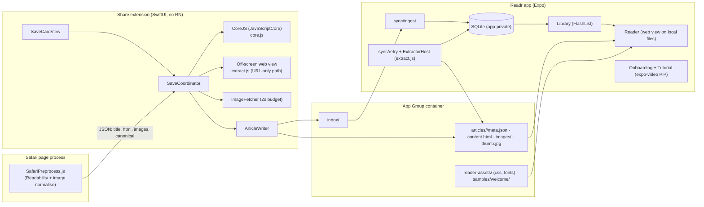
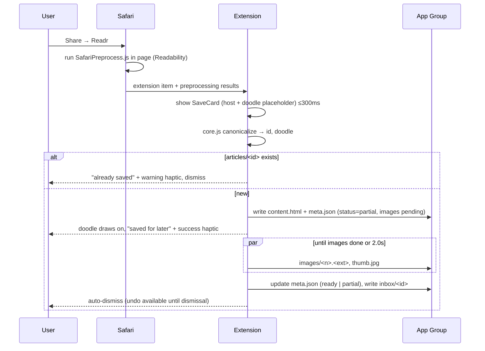

# feat: Readr v1 — share-to-save offline reader

## Summary

- **What:** Build Readr as an Expo SDK 57 iOS app with a native SwiftUI share extension.
- **Saving:** The extension captures the article (text and images) into an App Group folder while its save card is on screen.
- **App:** The app ingests those saves into SQLite and shows them in a One Year–style library. It opens them in a serif web-view reader that works offline.
- **Onboarding:** A practice save happens inside the app, followed by a picture-in-picture tutorial over Safari.
- **Code layout:** The code is split so that three contexts share one tested JavaScript core and one design-token source: the app, the extension, and Safari's page.

---

## Problem Frame

People save articles for flights, then find a dead link or missing images once they're offline. Capture has to happen at share time, inside iOS's tight share-extension limits. The app then has to be honest about which items are fully offline (see origin: `docs/brainstorms/2026-09-24-readr-offline-reader-requirements.md`).

The repo is greenfield. The only existing material is the origin requirements doc and the design system (`docs/design/design-system.md`).

---

## Requirements

Requirements carry forward origin R1–R19, F1–F5 and AE1–AE7 unchanged.

**Plan-level requirements (performance and structure):**

- P1. **Extension launch:** the save card's first frame appears within 300 ms of tapping Readr. The card can be dismissed within about 2 s (origin R6).
- P2. **Extension memory:**
  - peak resident memory stays under 60 MB, well below the roughly 120 MB limit;
  - no React Native runtime runs in the extension.
- P3. **App cold start:**
  - the library is interactive within 800 ms on an iPhone 13-class device;
  - the splash screen stays up until the first library query resolves.
- P4. **Library scrolling:** 60 fps (120 on ProMotion) with 500 saved articles. No row re-renders when a different row changes.
- P5. **Opening an article:** 250 ms or less from tap to visible body text, with the zoom transition masking web-view warm-up.
- P6. **Single sources of truth:**
  - URL canonicalisation, article IDs, doodle choice and extraction logic live in one TypeScript core, tested in Jest.
  - Design tokens and doodles live in one source that generates the Swift equivalents.

---

## Key Technical Decisions

| Decision | Rationale |
|---|---|
| **Native SwiftUI share extension** via `@bacons/apple-targets` | Share extensions are capped at about 120 MB. React Native in an extension is heavy and slow to launch (P1, P2). |
| **Readability runs inside Safari's page** via `NSExtensionJavaScriptPreprocessingFile` for Safari shares | Captures exactly what the user sees, including content they've already unlocked (origin R3/AE3). The extension receives small JSON instead of hosting a DOM (P2). |
| **One extraction bundle (`extract.js`) runs in three places** | It runs in Safari preprocessing, in an off-screen web view in the extension for URL-only shares, and in a hidden web view in the app for retries. Three pipelines would drift. |
| **The shared core runs in the extension via JavaScriptCore** (`core.js`: canonicalise, ID, doodle index) | Duplicate detection and doodle choice must match everywhere. A plain JSContext without a DOM costs a few MB. Jest tests the same source (P6). |
| **Article ID = FNV-1a-64 of the canonical URL**, used as the folder name | "Already saved" becomes a filesystem existence check in the extension, with no database needed (origin AE1). |
| **The extension is the only creator of articles. The app ingests via `inbox/` markers into an app-private SQLite database.** | Two processes never share a database: no cross-process locks, and no 0xdead10cc termination when the extension is suspended. |
| **Images are fetched inside the extension within the save-card window** (≤6 concurrent, hard 2.0 s total budget). Leftovers become `partial`. | Keeps the extension simple and the card honest. The app finishes leftovers when it's online (origin R5, F5). Background download sessions are deferred. |
| **Reader = `react-native-webview` loading local files** with a bundled stylesheet and fonts copied into the App Group | Gives real typographic control (optical sizes, italics, hyphenation, drop caps), text selection for later highlights, and handles images well. |
| **Practice sample is identified by URL but its content is bundled** | The extension recognises `https://readr.app/welcome`. It copies a pre-seeded sample from the App Group instead of fetching, so the practice save works offline. This resolves the origin's "bundled or hosted" question. |
| **Expo Router Stack with the iOS zoom transition** (`Link.AppleZoom`, SDK 55+, alpha) | Native feel when opening an article. Falls back to the default push if the alpha API misbehaves. |
| **FlashList v2 for the library, expo-image for thumbnails.** Thumbnails are downscaled to 112 px at ingest. | Meets P4. Decoding full-size lead images in rows is the usual scroll-jank source. |
| **Fonts are embedded at build time** (expo-font config plugin), not loaded at runtime | Removes font loading from startup (P3). |
| **expo-video with `supportsPictureInPicture` and `startsPictureInPictureAutomatically`.** The tutorial MP4 is bundled. | System picture-in-picture carries the tutorial over Safari (origin R15/AE7) and works offline. |
| **Light-only.** `userInterfaceStyle: light` in app config. The extension is locked to `.light`. | Origin decision. |

---

## High-Level Technical Design

### System topology



### Safari save sequence (F1)



### Article status lifecycle

```mermaid
stateDiagram-v2
    [*] --> partial: text written, images pending
    [*] --> link_only: extraction failed / fetch failed
    partial --> ready: all images present
    link_only --> partial: retry extracts text
    partial --> partial: retry, some images still missing
    ready --> read: reader reached end (read_at set)
    read --> ready: user marks unread (not in v1 UI; state allowed)
    ready --> [*]: delete
    partial --> [*]: delete
    link_only --> [*]: delete
    read --> [*]: delete
```



`read` is stored as `read_at` rather than as a status. An article is both `ready` or `partial` **and** read or unread. The flight check counts `partial` plus `link_only` regardless of read state.

### Performance budgets

| Surface | Budget | Main levers |
|---|---|---|
| Extension first frame | ≤300 ms | SwiftUI only. Card shows the host name and a placeholder immediately. The JSContext and web view are created lazily. |
| Extension peak memory | <60 MB | No RN. Safari path hosts no DOM. Images streamed to disk and never held in memory. Thumbnails made with ImageIO, not UIImage. |
| Card dismissible | ≤2.0 s | Text is written before any image work. Images run under a hard budget. |
| App cold start to interactive library | ≤800 ms | Embedded fonts. Synchronous SQLite first page (50 rows). Onboarding, reader, video and extractor routes load lazily. Splash held until the first query. |
| Library scroll | 60/120 fps at 500 rows | FlashList v2. Memoised rows keyed by `id`+`updated_at`. 112 px thumbnails. Static doodles (draw-on only for newly inserted rows). |
| Open article | ≤250 ms to text | Zoom transition. Title rendered natively in the header while the web view loads. Web view body fades in on the `load` event. Local file URL, no network. |

---

## Output Structure

```
app/                                  # Expo Router
  _layout.tsx                         # root Stack, providers, MiniPlayer overlay, ingest on focus
  index.tsx                           # Library
  article/[id].tsx                    # Reader
  reader-settings.tsx                 # formSheet
  onboarding/_layout.tsx
  onboarding/index.tsx                # SetupCoach
  onboarding/practice.tsx
  onboarding/letter.tsx
src/
  core/                               # pure TS, bundled to core.js for the extension
    canonicalize.ts  articleId.ts  doodleIndex.ts  index.ts
    __tests__/
  extract/                            # bundled to extract.js + SafariPreprocess.js
    extract.ts  images.ts  safariPreprocess.ts
    __tests__/  __fixtures__/*.html
  design/
    tokens.ts  typography.ts  motion.ts  haptics.ts
    doodles/doodles.json  doodles/Doodle.tsx  doodles/registry.ts
    components/InkButton.tsx FadedTextButton.tsx DateChip.tsx PillToggle.tsx
               FrostedCard.tsx TiltedCard.tsx Toast.tsx EmptyState.tsx
    __tests__/
  data/
    sharedContainer.ts  db.ts  articles.ts  settings.ts  schema.ts
    __tests__/
  sync/
    ingest.ts  retry.ts  connectivity.ts  ExtractorHost.tsx  seedGroup.ts
    __tests__/
  features/
    library/ LibraryScreen.tsx ArticleRow.tsx ShelfStrip.tsx FlightStatus.tsx
             SwipeableRow.tsx selectors.ts useLibrary.ts __tests__/
    reader/  ReaderScreen.tsx ReaderWebView.tsx readerHtml.ts ReaderChrome.tsx
             ProgressHairline.tsx useReadingPosition.ts settingsStore.ts
             ReaderSettingsSheet.tsx __tests__/
    onboarding/ SetupCoach.tsx PhoneMock.tsx practiceSave.ts FounderLetter.tsx __tests__/
    tutorial/ MiniPlayer.tsx snap.ts tutorialStore.ts useFirstSafariSave.ts __tests__/
assets/
  fonts/ (GeistMono, Newsreader, InstrumentSerif-Italic)
  reader/reader.css
  samples/welcome/ (meta.json, content.html, images/)
  video/tutorial.mp4
targets/share/
  expo-target.config.js  Info.plist  share.entitlements
  ShareViewController.swift  SaveCardView.swift  SaveCoordinator.swift
  ArticleWriter.swift  ImageFetcher.swift  CoreJS.swift  WebExtractor.swift
  Haptics.swift
  generated/ Theme.swift Doodles.swift core.js extract.js SafariPreprocess.js (+ fonts)
scripts/
  build-bundles.ts                    # esbuild: core.js, extract.js, SafariPreprocess.js
  gen-swift.ts                        # tokens.ts + doodles.json → Theme.swift, Doodles.swift
app.config.ts  eas.json  package.json  jest.config.js  tsconfig.json
```

---

## Implementation Units

### Phase A — Foundation

### U1. Project scaffold and native configuration

**Goal:** A dev-build Expo SDK 57 app with the share target, App Group, embedded fonts, picture-in-picture and light-only configured.

**Requirements:** P3, origin Dependencies.

**Dependencies:** none.

**Files:**
- `app.config.ts`
- `eas.json`
- `package.json`
- `tsconfig.json`
- `jest.config.js`
- `targets/share/expo-target.config.js`
- `targets/share/share.entitlements`
- `targets/share/Info.plist`

**Approach:**
- **Bundle and App Group:** bundle `com.devesh.readr`, extension `com.devesh.readr.share`, App Group `group.com.devesh.readr` on both targets.
- **Plugins:**
  - `expo-font` with the fonts embedded;
  - `expo-video` with `supportsPictureInPicture: true` and `supportsBackgroundPlayback: true`;
  - `expo-router`;
  - `@bacons/apple-targets`.
- **Share extension `Info.plist`:**
  - activation rule: web URL max 1, web page max 1, text;
  - `NSExtensionJavaScriptPreprocessingFile = SafariPreprocess`;
  - light appearance.
- **App config:** `userInterfaceStyle: "light"`, `newArchEnabled`, Hermes.
- **Local runs:** Continuous native generation. `expo prebuild` is the default on SDK 57, and dev builds run through `expo run:ios` or EAS.

**Test expectation:** none, this is configuration only.

**Verification:**
- The dev build installs on a device.
- "Readr" appears in Safari's share sheet with an empty placeholder extension.
- The main app launches in light mode.

### U2. Design system in code, plus the Swift generator

**Goal:** Tokens, type, motion, haptics, doodles and base components from `docs/design/design-system.md`, with generated Swift equivalents for the extension.

**Requirements:** origin R17, R18. P6.

**Dependencies:** U1.

**Files:**
- `src/design/tokens.ts`
- `src/design/typography.ts`
- `src/design/motion.ts`
- `src/design/haptics.ts`
- `src/design/doodles/doodles.json`
- `src/design/doodles/registry.ts`
- `src/design/doodles/Doodle.tsx`
- `src/design/components/*.tsx`
- `scripts/gen-swift.ts`
- `targets/share/generated/Theme.swift`
- `targets/share/generated/Doodles.swift`
- `src/design/__tests__/registry.test.ts`
- `src/design/__tests__/gen-swift.test.ts`

**Approach:**
- **Tokens** are plain TS constants: colours, spacing, radii, type scale, spring presets and a haptic map. Components import only from them.
- **Doodles:**
  - `doodles.json` holds about 24 entries, each with a name, a 32×32 viewBox and SVG path `d` strings (single stroke).
  - `Doodle.tsx` renders them with react-native-svg.
  - An optional `drawOn` prop animates `strokeDashoffset` via Reanimated `animatedProps`. It is off by default, so static doodles cost nothing.
- **Swift generation:**
  - `gen-swift.ts` emits `Theme.swift` (colours and fonts) and `Doodles.swift`, with path commands pre-parsed into SwiftUI `Path` builders.
  - The extension needs no SVG parser.
  - `trim(from:to:)` gives the same draw-on effect in SwiftUI.
- **Haptics:** `haptics.ts` wraps expo-haptics with semantic names (`press`, `success`, `warning`, `threshold`, `selection`, `soft`). It becomes a no-op when the OS "reduce haptics" setting is unavailable.
- **Motion:** `motion.ts` exposes spring presets and a `useReducedMotionSafe` helper that swaps transforms for opacity.

**Patterns to follow:** the component spec table and motion table in `docs/design/design-system.md`.

**Test scenarios:**
- Every doodle has a unique name, uses a 32 viewBox, and has at least one non-empty path.
- The registry exposes a stable ordering. The index-to-name mapping is snapshot-tested, so adding doodles only appends and existing articles keep their doodle.
- Given `tokens.ts`, the generator output contains every colour token as a Swift `Color` with matching hex (snapshot).
- The generator turns a path with M/L/C/Q/Z commands into the expected Swift builder calls. An unsupported command fails the build with the doodle name.

**Verification:**
- A dev-only gallery screen shows every component and every doodle drawing itself.
- Swift files compile in the extension target.

### U3. Shared core and extraction bundles

**Goal:** One tested source for canonicalisation, IDs, doodle choice and article extraction, bundled for JavaScriptCore, Safari preprocessing and web views.

**Requirements:** origin R3, R4, R8, AE1, AE2, AE3. P6.

**Dependencies:** U2 (doodle count).

**Files:**
- `src/core/canonicalize.ts`
- `src/core/articleId.ts`
- `src/core/doodleIndex.ts`
- `src/core/index.ts`
- `src/extract/extract.ts`
- `src/extract/images.ts`
- `src/extract/safariPreprocess.ts`
- `scripts/build-bundles.ts`
- `targets/share/generated/{core,extract,SafariPreprocess}.js`
- `src/core/__tests__/canonicalize.test.ts`
- `src/core/__tests__/articleId.test.ts`
- `src/extract/__tests__/extract.test.ts`
- `src/extract/__fixtures__/*.html`

**Approach:**
- **Canonicalisation:**
  - lowercase the scheme and host, and strip a leading `www.`;
  - drop the fragment;
  - remove tracking parameters (`utm_*`, `fbclid`, `gclid`, `mc_*`, `ref`, `ref_src`, `igshid`, `si`) and sort the remaining parameters;
  - normalise a trailing slash;
  - prefer a same-site `<link rel=canonical>` when extraction supplies one.
- **ID:** 16 hex characters of FNV-1a-64 over the canonical URL (UTF-8). Doodle index = ID modulo the doodle count.
- **Extraction** wraps `@mozilla/readability`:
  1. pre-pass: promote `data-src`, `data-lazy-src` and the `<noscript>` image, pick `srcset` ≤1400w, and resolve relative URLs;
  2. run Readability;
  3. post-pass: strip scripts, iframes, forms and inline styles; keep `figure`, `figcaption`, `blockquote`, `pre`/`code` and `table`;
  4. rewrite `img src` to `images/<n>.<ext>` placeholders plus an image manifest;
  5. compute word count and minutes (230 wpm).
- It returns `{ok:false, reason}` when the text has fewer than 250 characters or Readability returns null. This feeds the link-only decision (origin AE2).
- **Safari preprocessing:** `safariPreprocess.ts` implements Apple's `ExtensionPreprocessingJS.run` contract. It calls `extract(document)` and passes the result to `completionFunction`.
- **Bundling:** `build-bundles.ts` uses esbuild to produce IIFE bundles: `core.js` (no DOM APIs), `extract.js` and `SafariPreprocess.js`.

**Execution note:** Implement test-first. The fixtures are the contract for all three runtimes.

**Test scenarios:**
- Canonicalisation:
  - `https://www.Example.com/a/?utm_source=x&b=2&a=1#top` → `https://example.com/a?a=1&b=2`.
  - Two share variants of the same NYT URL, one with `?smid=nytcore-ios-share`, produce the same ID. Covers AE1.
  - A non-http(s) input (`mailto:`, `file:`) is rejected with a typed error.
- ID and doodle:
  - The ID is deterministic across runs.
  - The doodle index is always within 0 to count−1.
- Extraction fixtures:
  - A blog post with lazy `data-src` images yields local `images/0.jpg` references and a manifest with absolute source URLs.
  - A fixture carrying a paywall stub with the full DOM present extracts the full body, not the teaser. Covers AE3.
  - A tweet-like page, or an app shell with an empty body, returns `ok:false`. Covers AE2.
  - Inline `<script>` and `<iframe>` are absent from the output HTML. `<figure>` with `<figcaption>` survives.
  - Relative `srcset` entries resolve against the page URL, and the widest candidate ≤1400w is chosen.
- Bundles: the built `core.js` evaluates in a DOM-less context (Node `vm`) and exposes `canonicalize` and `articleId`.

**Verification:**
- All fixtures pass.
- The bundles are generated into `targets/share/generated/` by the build step.

### Phase B — Capture

### U4. Share extension: capture pipeline and save card

**Goal:** Tapping Readr from any app saves the article into the App Group with an honest three-outcome card (saved / already saved / link only), within the performance budgets.

**Requirements:** origin R1–R6, R8, F1, F2, AE1–AE3, AE5. P1, P2.

**Dependencies:** U1, U2, U3.

**Files:**
- `targets/share/ShareViewController.swift`
- `targets/share/SaveCardView.swift`
- `targets/share/SaveCoordinator.swift`
- `targets/share/ArticleWriter.swift`
- `targets/share/ImageFetcher.swift`
- `targets/share/CoreJS.swift`
- `targets/share/WebExtractor.swift`
- `targets/share/Haptics.swift`
- `docs/qa/share-extension-checklist.md`

**Approach:**
- **Card:** `ShareViewController` hosts `SaveCardView` in a `UIHostingController` and shows it immediately with the host name and a doodle placeholder. All work runs in `SaveCoordinator` (Swift concurrency, main-actor UI).
- **Input resolution, in order:**
  1. Safari preprocessing results (`NSExtensionJavaScriptPreprocessingResultsKey`);
  2. otherwise a `public.url`;
  3. otherwise a URL parsed from `public.plain-text`.
- **Canonical URL and ID:** `CoreJS` creates the JSContext lazily, loads `core.js` once, and returns canonical URL, ID and doodle.
  - If `articles/<id>/` exists, the card shows "already saved" with a warning haptic and a shake. Covers AE1.
  - If the canonical URL is `readr.app/welcome`, the extension copies `samples/welcome/` into `articles/<id>/` with `source=practice`.
- **URL-only path:**
  - Fetch the HTML with `URLSession` (4 s timeout, mobile Safari user agent).
  - Load it into an off-screen web view with `allowsContentJavaScript=false`.
  - Run `extract.js` via `callAsyncJavaScript` in a dedicated content world.
  - On `ok:false` or a network error, write a link-only record. The card shows "saved link — needs internet".
- **Writing the article:**
  - `ArticleWriter` writes `content.html` and `meta.json` atomically (temp file then rename).
  - It sets `status=partial` when images are pending, otherwise `ready`.
  - It writes `inbox/<id>` last, so the app never ingests a half-written folder.
- **Images:**
  - `ImageFetcher` streams downloads to disk, 6 concurrent, with a 2.0 s wall-clock budget measured from card appearance.
  - It creates `thumb.jpg` (112 px) from the lead image with ImageIO downsampling, never decoding full-size.
  - When it finishes, it updates `images_done` in `meta.json`. The status becomes `ready` only if every image is present.
- **Undo:** deletes `articles/<id>/` and `inbox/<id>`, then dismisses.
- **Haptics:** success, warning and press, via `UINotificationFeedbackGenerator` / `UIImpactFeedbackGenerator`.
- **Dismissal:** auto-dismiss 900 ms after the "saved" state, or when images finish, whichever is later, capped at 2.0 s total. Then call `completeRequest`.
- **Memory:** no `UIImage` for full-size images. The web view is torn down right after extraction, and the JSContext is released on dismiss.

**Test scenarios:** extension logic is covered by the shared-core tests (U3) plus the device QA checklist below. XCTest for the extension is deferred.
- Covers F1 / AE5. Safari, article page: card within 300 ms, "saved for later", success haptic, back in Safari in 2 s or less. Later, in airplane mode, the app opens it with images.
- Covers AE3. Safari, logged-in paywalled article: the full body is saved.
- Covers AE1. Share the same article twice, once with UTM parameters: the second time shows "already saved", a warning haptic and no new folder.
- Covers F2 / AE2. Share an X post from the X app: the card shows "saved link — needs internet", and `meta.json` has `status=link_only`.
- Share from Chrome with the device offline: link-only, and the card does not hang past 2 s plus the 4 s fetch timeout. Timeout path.
- An image-heavy article (40 images) on slow 3G: the card is dismissible in about 2 s, `status=partial`, and `images_done` is less than `images_total`.
- Undo tapped during the "saved" state: no folder and no inbox marker remain.
- Plain-text share containing a URL mid-sentence: the URL is detected and saved.
- Memory: Xcode memory gauge peak below 60 MB on a 5,000-word article with 20 images.

**Verification:** every row of `docs/qa/share-extension-checklist.md` passes on a physical device.

### U5. Data layer and ingest

**Goal:** The app mirrors App Group articles into SQLite on launch and foreground, and deletes cleanly.

**Requirements:** origin R7, R10, AE5. P3.

**Dependencies:** U1, U3.

**Files:**
- `src/data/sharedContainer.ts`
- `src/data/schema.ts`
- `src/data/db.ts`
- `src/data/articles.ts`
- `src/data/settings.ts`
- `src/sync/ingest.ts`
- `src/sync/seedGroup.ts`
- `src/data/__tests__/articles.test.ts`
- `src/sync/__tests__/ingest.test.ts`

**Approach:**
- **Container:** `sharedContainer.ts` resolves the App Group folder through `Paths.appleSharedContainers['group.com.devesh.readr']` and exposes typed sub-paths.
- **Database:** `db.ts` opens an app-private expo-sqlite database with WAL, migrates with `PRAGMA user_version`, and runs the first library page query synchronously for startup.
- **`articles` table:**
  - `id` (primary key), `url`, `canonical_url`, `title`, `byline`, `site`, `excerpt`, `doodle`, `minutes`, `word_count`;
  - `status` (ready | partial | link_only), `source` (safari | share | practice);
  - `saved_at`, `read_at`, `progress`, `scroll_y`, `images_total`, `images_done`, `has_thumb`, `updated_at`.
- **Indexes:** `(read_at, saved_at DESC)` and `(status)`.
- **`settings` table:** a key/value store.
- **Ingest:** runs on app start and on AppState `active`.
  - It lists `inbox/`. For each marker it reads `meta.json`, upserts the row and deletes the marker.
  - A malformed `meta.json` is skipped and logged. The marker is kept for 3 attempts, then quarantined.
  - A full reconcile (listing `articles/`) runs only when the database is empty or on first launch after install, to recover from lost markers.
- **Delete:** removes the database row first, then the folder, so the UI never points at a missing folder.
- **Seeding:** `seedGroup.ts`, on first launch or when the app version changes, copies `assets/reader/*`, the fonts and `assets/samples/welcome/` into the App Group. This lets the reader web view and the extension's practice path read them.

**Test scenarios:**
- Given 3 inbox markers with valid `meta.json`, ingest inserts 3 rows and removes the 3 markers.
- Given a marker whose `meta.json` is missing or truncated, the row is not inserted, the marker survives, and it is quarantined after the 3rd attempt.
- Re-ingesting an existing ID (the extension updated images after the first ingest) updates `status`, `images_done` and `updated_at` without duplicating the row.
- Delete removes the row and then the folder. A simulated folder-delete failure leaves no row (the orphan folder is cleaned on the next reconcile).
- Reconcile with an empty database and 2 article folders inserts both.
- Migrations: a fresh database reaches the latest `user_version`, and running migrations twice is a no-op.
- Covers AE5. Ingest reads a folder the extension wrote while the app was never launched.

**Verification:** saving 5 articles from Safari, then cold-launching the app, lists all 5 with correct status.

### Phase C — Library and reader

### U6. Library screen

**Goal:** A One Year–styled library with a doodle per row, the shelf strip, a read section, swipe-to-delete, an offline chip and the flight check.

**Requirements:** origin R5 (flight status), R7–R10, R19, F5, AE4, AE6. P3, P4.

**Dependencies:** U2, U5.

**Files:**
- `app/index.tsx`
- `src/features/library/LibraryScreen.tsx`
- `src/features/library/ArticleRow.tsx`
- `src/features/library/ShelfStrip.tsx`
- `src/features/library/FlightStatus.tsx`
- `src/features/library/SwipeableRow.tsx`
- `src/features/library/selectors.ts`
- `src/features/library/useLibrary.ts`
- `src/sync/connectivity.ts`
- `src/features/library/__tests__/selectors.test.ts`

**Approach:**
- **Data:** `useLibrary` subscribes to a small store (zustand) that ingest and delete update. It reads pages of 50 from SQLite.
- **Pure selectors derive:**
  - the unread and read groups;
  - this month's shelf dots (read → doodle);
  - the flight status: `n` not ready = `partial` + `link_only`; zero → "all set for your flight";
  - the offline state from NetInfo.
- **List:** FlashList v2 with section headers. The read section starts collapsed with a count chip ("**07** read").
- **Rows:**
  - `ArticleRow` is memoised on `id` + `updated_at`. It shows the doodle stamp (static), a Newsreader title (2 lines), mono meta, and an expo-image thumbnail from `thumb.jpg`.
  - Link-only rows show a faded "needs internet" chip. Partial rows show a small ink ring.
- **Swipe:** Gesture Handler + Reanimated, with rubber-banding and a threshold haptic, then delete through the repository.
- **New arrivals:** the row height animates in and its doodle draws on (only for IDs added since the last render).
- **Empty state:** a large doodle drawing itself, "nothing saved yet.", and an InkButton "show me how" that routes to onboarding.

**Patterns to follow:** the ArticleRow, ShelfStrip and EmptyState specs, and the motion table in `docs/design/design-system.md`.

**Test scenarios:**
- Grouping:
  - Given 3 unread and 2 read articles, the selectors return unread newest first and read in a separate group.
  - Covers AE6. After `read_at` is set, the article moves groups and its shelf dot switches to its doodle.
- Flight status:
  - Covers AE4. With 1 `partial` and 1 `link_only`, the text is "02 not ready offline" with 02 as the ink numeral.
  - When both become `ready`, the text is "all set for your flight".
  - An empty library shows no flight status.
- Shelf strip: articles saved last month are excluded, and exactly one dot appears per article this month.
- Offline: when NetInfo reports offline, the "offline" chip and warm copy show. They are hidden when online.

**Verification:**
- On device with 500 seeded articles, the Perf Monitor shows sustained 60/120 fps while flinging.
- Swipe-delete removes both the row and the folder.

### U7. Reader

**Goal:** An offline serif reader with zoom entry, hiding chrome, a progress hairline, remembered position, "fin." and a light settings sheet.

**Requirements:** origin R11, R12, F4, AE6. P5.

**Dependencies:** U2, U5, U6.

**Files:**
- `app/article/[id].tsx`
- `app/reader-settings.tsx`
- `src/features/reader/ReaderScreen.tsx`
- `src/features/reader/ReaderWebView.tsx`
- `src/features/reader/readerHtml.ts`
- `src/features/reader/ReaderChrome.tsx`
- `src/features/reader/ProgressHairline.tsx`
- `src/features/reader/useReadingPosition.ts`
- `src/features/reader/settingsStore.ts`
- `src/features/reader/ReaderSettingsSheet.tsx`
- `assets/reader/reader.css`
- `src/features/reader/__tests__/readerHtml.test.ts`
- `src/features/reader/__tests__/useReadingPosition.test.ts`

**Approach:**
- **Page file:**
  - `readerHtml.ts` builds a shell with meta, a native-matching title block, dek, byline and body.
  - It links `../../reader-assets/reader.css` and sets CSS variables for paper tone, font family, size and measure.
  - It is written once per article as `reader.html` in the article folder. It is regenerated only when the template version changes, not on settings changes, which apply through injected CSS variables.
- **Loading:** the web view loads `file://…/articles/<id>/reader.html` with read access to the whole App Group folder. Network requests are blocked by an `onShouldStartLoadWithRequest` allowlist; external links open in Safari.
- **Scroll bridge:**
  - An injected script posts `{y, h, vh}` on `requestAnimationFrame`, only when progress changes by at least 0.5%. It drives a Reanimated shared value for the hairline and for hiding and showing the chrome on direction changes.
  - Position is saved, debounced every 1 s, and restored with `window.scrollTo` on load.
  - Reaching the bottom (≥98%) shows "fin." with a soft haptic, sets `read_at` once, and never un-reads.
- **Missing images:** missing local images render as an ink-wash placeholder box sized from manifest dimensions, never a broken-image icon.
- **Zoom transition:** the row wraps `Link.AppleZoom`, and the reader header is the zoom target. The native header shows the title while the web view warms up, and the body fades in on load.
- **Settings sheet:** three paper tones, serif/sans/mono, 7 size steps, narrow/wide. Persisted in the `settings` table and applied live via `injectJavaScript`.

**Test scenarios:**
- Page file contents:
  - `readerHtml` escapes title, byline and excerpt (a title with `<script>` renders as text).
  - The page references `reader-assets` with a correct relative path from `articles/<id>/`.
- Settings: switching from mono to serif changes only CSS variables, with no rewrite of `reader.html`.
- Reading position:
  - A progress sequence 0 → 0.5 → 0.99 sets `read_at` exactly once. Covers AE6.
  - A save/restore round trip returns the same `scroll_y`.
  - Short articles that fit in the viewport are marked read after a 3 s dwell rather than never.
- Link-only article: opening it shows an "open original" state with the needs-internet copy instead of an empty web view.

**Verification:**
- In airplane mode, a ready article opens with fonts and images, and the hairline tracks.
- Reopening restores the position.
- A tap-to-text screen recording measures 250 ms or less.

### U8. Retry engine

**Goal:** Link-only and partial articles quietly complete whenever the app is open and online.

**Requirements:** origin R5, F5, AE4.

**Dependencies:** U3, U5, U6.

**Files:**
- `src/sync/retry.ts`
- `src/sync/ExtractorHost.tsx`
- `src/sync/connectivity.ts`
- `src/sync/__tests__/retry.test.ts`

**Approach:**
- **Trigger:** when the app is foreground and online, `retry.ts` builds a queue of `link_only` articles, then `partial` ones, newest first.
- **Link-only items:**
  1. fetch the HTML with `fetch` (10 s timeout);
  2. strip `<script>`;
  3. hand it to `ExtractorHost`, a single hidden web view that mounts only while the queue has link-only work, runs `extract.js` via `injectedJavaScript`, and posts the result back;
  4. write `content.html` and the manifest through the same folder layout.
- **Partial items:** download the missing images from the manifest with expo-file-system, concurrency 4, and generate the thumbnail if it's missing.
- **Updating state:** after each item, update `meta.json` and the database row. The store refreshes, and FlightStatus recounts.
- **Back-off:** per-item attempt count with backoff (1 min, 10 min, 1 h). After 5 failures, stop until the user opens the item. Going offline pauses the queue.
- **Ownership:** only the app writes to existing article folders after the extension's first write, and the retry engine never deletes articles.

**Test scenarios:**
- Queue order: a link-only item saved yesterday runs before a partial item saved today (link-only first). Within a status, newest first.
- A link-only item whose extraction succeeds becomes `partial`, then `ready` once its images finish. Covers AE4.
- An extraction that returns `ok:false` stays `link_only` with the attempt count incremented and the next attempt time set.
- Going offline mid-queue stops further work, and the current item's partial image writes are not counted as done.
- An image returning 404 counts as a failure for that image only. The article stays `partial`, and other images still complete.
- Covers AE4. 2 items not ready, both retries succeed: FlightStatus goes from "02 not ready offline" to "all set for your flight".

**Verification:** save 3 link-only items while offline. Open the app online, and within about 30 s all three become ready without user action.

### Phase D — Onboarding and tutorial

### U9. Onboarding and the practice save

**Goal:** One Year–style onboarding that teaches the share sheet and completes a real save inside the app, ending with the founder-letter note.

**Requirements:** origin R13, R14, F3.

**Dependencies:** U2, U4, U5, U6.

**Files:**
- `app/onboarding/_layout.tsx`
- `app/onboarding/index.tsx`
- `app/onboarding/practice.tsx`
- `app/onboarding/letter.tsx`
- `src/features/onboarding/SetupCoach.tsx`
- `src/features/onboarding/PhoneMock.tsx`
- `src/features/onboarding/practiceSave.ts`
- `src/features/onboarding/FounderLetter.tsx`
- `assets/samples/welcome/*`
- `src/features/onboarding/__tests__/practiceSave.test.ts`

**Approach:**
- **First-launch gate:** a `settings.onboarded` flag decides whether the app opens onboarding or the library. The root layout redirects without flashing the library.
- **SetupCoach:**
  - a phone mock (TiltedCard) animates a share sheet with the Readr icon highlighted;
  - the copy is "tap **readr** in the share sheet";
  - an InkButton "save my first article" and a faded "skip".
- **Practice save:**
  - `practiceSave.ts` opens the native share sheet (React Native `Share.share`) with `https://readr.app/welcome`.
  - When the sheet closes, it runs ingest and checks for a row with `source=practice`.
  - Success: celebration, a success haptic, and the new row visible in a miniature library preview.
  - Failure (Readr not tapped): "try again", plus a hint about "more…" and pinning.
- **Letter:** the founder-letter screen ("hey friend …") with a hand-drawn signature SVG. It sets `onboarded=true`.

**Test scenarios:**
- Covers F3. After the share sheet closes with the practice record ingested, `practiceSave` resolves `success`.
- The share sheet closes without a practice record: it resolves `not_saved`, and the UI offers "try again".
- The practice record already exists (onboarding re-run): it resolves `already_saved` and still counts as success.
- `onboarded` becomes true only after the letter screen, so killing the app mid-flow resumes onboarding.

**Verification:** a fresh install on device completes the practice save in under 60 s (origin Success Criteria), fully offline.

### U10. Tutorial mini player, picture-in-picture over Safari, and the first-save celebration

**Goal:** The tutorial plays in a draggable mini player, continues as system picture-in-picture in Safari, and ends with a celebration on the first real Safari save.

**Requirements:** origin R15, R16, F3, AE7.

**Dependencies:** U1, U5, U9.

**Files:**
- `src/features/tutorial/MiniPlayer.tsx`
- `src/features/tutorial/snap.ts`
- `src/features/tutorial/tutorialStore.ts`
- `src/features/tutorial/useFirstSafariSave.ts`
- `app/_layout.tsx`
- `assets/video/tutorial.mp4`
- `src/features/tutorial/__tests__/snap.test.ts`
- `src/features/tutorial/__tests__/useFirstSafariSave.test.ts`

**Approach:**
- **Mini player:**
  - `MiniPlayer` lives in the root layout overlay, so it persists across screens.
  - It is an expo-video `VideoView` in a 16:9 frosted frame.
  - A pan gesture uses velocity projection: `snap.ts` picks the nearest of 4 safe-area corners from a projected end point, with a light haptic on snap. Tapping expands it.
  - It has `allowsPictureInPicture` and `startsPictureInPictureAutomatically`.
- **"try it in safari":** marks `tutorialStartedAt` and opens `https://readr.app/welcome` in Safari. Leaving the app while it plays triggers system picture-in-picture.
- **First real save:** `useFirstSafariSave` watches ingest results for the first article with `source=safari` and `saved_at > tutorialStartedAt`. It then stops playback, dismisses the player, and shows the one-time "you did it" moment (a `firstSafariSaveCelebrated` flag in settings).
- **Where it's offered:** from the empty state, the end of onboarding and the settings screen.

**Test scenarios:**
- Snapping:
  - A release at the centre with velocity toward the top-left snaps to top-left.
  - A release near the bottom-right with zero velocity snaps to bottom-right.
  - A strong fling past the screen edge clamps to the correct corner.
- First-save detection:
  - Covers AE7. After the tutorial starts, ingesting a `source=safari` record fires the celebration once and stops the video.
  - A `practice` record, or a Safari record saved before `tutorialStartedAt`, does not fire.
  - A second qualifying save after the celebration does not fire again.

**Verification:**
- On device, "try it in safari" keeps the video playing in picture-in-picture over Safari.
- Sharing to Readr from there and returning to the app shows the celebration, and the video is gone.

### Phase E — Hardening

### U11. Performance and accessibility pass

**Goal:** Verify and enforce the performance budgets, Reduce Motion behaviour and accessibility across every surface.

**Requirements:** P1–P5, origin R18, Success Criteria.

**Dependencies:** U4–U10.

**Files:**
- `docs/qa/performance-budgets.md`
- `src/design/motion.ts`
- the touched component files

**Approach:**
- **Measurement:**
  - Signposts (`os_signpost`) in the extension for first frame, text written and dismiss.
  - A dev-only JS timing log for cold start (native launch to first library commit) and open article (tap to web view `load`).
- **Lazy loading:** audit what loads at startup. The reader, onboarding, tutorial, `ExtractorHost` and expo-video must not load until first use. Verify with a Hermes profile.
- **Reduce Motion:** draw-on becomes an instant draw, the zoom becomes a crossfade, springs become opacity. Haptics stay.
- **Dynamic Type:**
  - reader size follows the settings sheet, not Dynamic Type;
  - UI mono text caps at the accessibility size where the layout still holds;
  - VoiceOver labels on doodles use the article title, not the doodle name.

**Test scenarios:** `motion.ts` returns opacity-only presets when reduced motion is on. The measured budgets are recorded as a table in `docs/qa/performance-budgets.md`.

**Verification:** each budget in the performance table is met on an iPhone 13-class device, or the deviation is recorded with a follow-up.

---

## System-Wide Impact

- **Two processes, one folder:**
  - The extension creates articles.
  - The app owns the database and all later mutations.
  - The folder layout and `meta.json` fields are a versioned contract (`schema: 1` in `meta.json`). Breaking changes need a migration in the ingest step.
- **Three JavaScript runtimes run one source:** Safari page, extension JavaScriptCore or web view, and the app's web view. Changing `src/extract` or `src/core` requires rebuilding the bundles. The build script runs from `prebuild` and CI so generated files never drift.
- **Storage growth:** images dominate. No automatic eviction in v1 (origin: delete is manual).

---

## Risks & Dependencies

| Risk | Mitigation |
|---|---|
| iOS kills the extension after `completeRequest`, leaving images partial | Accepted by design. The `partial` status, retry engine and flight check make it visible and self-healing. Background download sessions are a deferred follow-up. |
| Readability fails on unusual sites | The `ok:false` threshold routes to link-only (origin decision). The fixture suite grows with every bad site found. |
| `Link.AppleZoom` is alpha and has open issues with ScrollView sources | Keep a flag to fall back to the default push. Covered in U7 verification. |
| expo-video automatic picture-in-picture may not start when the video is muted or paused | Tutorial plays with audio, and the button only offers Safari while it's playing. Tested on device in U10. |
| Haptics inside share extensions may be suppressed on some iOS versions | Degrade silently. Visual state changes carry the meaning. |
| Paid Apple Developer account required for the App Group | Prerequisite before U1 can be verified on device. |
| SDK 56 Hermes/worklets memory regression | Pin SDK 57, where it's fixed. |

---

## Scope Boundaries

**Deferred for later (from origin):** bookmarks and highlights, on-device search and Spotlight, tags and folders, PDFs, text-to-speech.

**Outside this product's identity (from origin):** accounts and sync, dark mode, Android, paywall or subscription, social feeds.

### Deferred to Follow-Up Work

- Background download sessions so images finish after the extension closes.
- XCTest target for extension Swift logic. v1 relies on shared-core Jest tests plus the device checklist.
- Automatic storage eviction and a storage-usage screen.
- Licensing Signifier from Klim as the reading font (a token swap).
- Producing the tutorial video itself. U10 ships with a placeholder clip until the final recording exists.

---

## Open Questions

**Deferred to implementation:**
- Exact dimensions of the image-budget window (2.0 s total vs. 1.5 s after text) once measured on real 3G.
- Whether `callAsyncJavaScript` in a separate content world runs with `allowsContentJavaScript=false` on the minimum iOS version. If not, strip scripts from the HTML before loading, as the app's `ExtractorHost` does.
- Minimum iOS version: 18 is suggested for the zoom transition. Confirm it against expo-router's requirement at scaffold time.

---

## Sources & Research

- **Origin requirements:** `docs/brainstorms/2026-09-24-readr-offline-reader-requirements.md`.
- **Design system:** `docs/design/design-system.md` (One Year tokens sampled from Mobbin screens).
- **Expo SDK:** [Expo SDK 57](https://expo.dev/sdk/57) (RN 0.86, prebuild by default); [SDK 56 changelog](https://expo.dev/changelog/sdk-56) (Hermes/worklets regression fixed in 57).
- **Share extension setup:** [Expo Apple Targets — share extensions](https://www.mintlify.com/EvanBacon/expo-apple-targets/guides/share-extensions); [expo-apple-targets repo](https://github.com/EvanBacon/expo-apple-targets).
- **App Group access and SQLite:** [expo-file-system `Paths.appleSharedContainers`](https://docs.expo.dev/versions/latest/sdk/filesystem/); [expo-sqlite docs](https://docs.expo.dev/versions/latest/sdk/sqlite/).
- **Picture-in-picture:** [expo-video docs](https://docs.expo.dev/versions/latest/sdk/video/).
- **Zoom transition:** [Expo Router zoom transition](https://docs.expo.dev/router/advanced/zoom-transition/) (iOS 18+, SDK 55+, alpha); known issue [expo#50042](https://github.com/expo/expo/issues/50042).
- **Safari preprocessing:** [NSExtensionJavaScriptPreprocessingFile](https://developer.apple.com/documentation/bundleresources/information-property-list/nsextension/nsextensionattributes/nsextensionjavascriptpreprocessingfile).
- **Extension memory limits:** [Dealing with memory limits in app extensions](https://blog.kulman.sk/dealing-with-memory-limits-in-app-extensions/); [React Native share extension limits](https://medium.com/kraaft-co/how-i-reached-the-limits-of-react-native-by-implementing-an-ios-share-extension-4f312b534f22).
